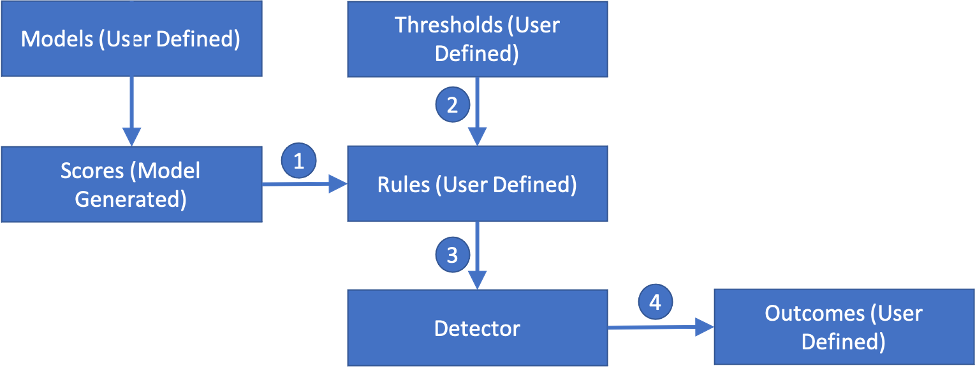
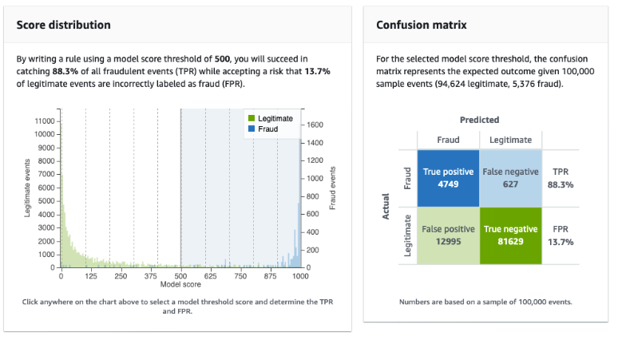
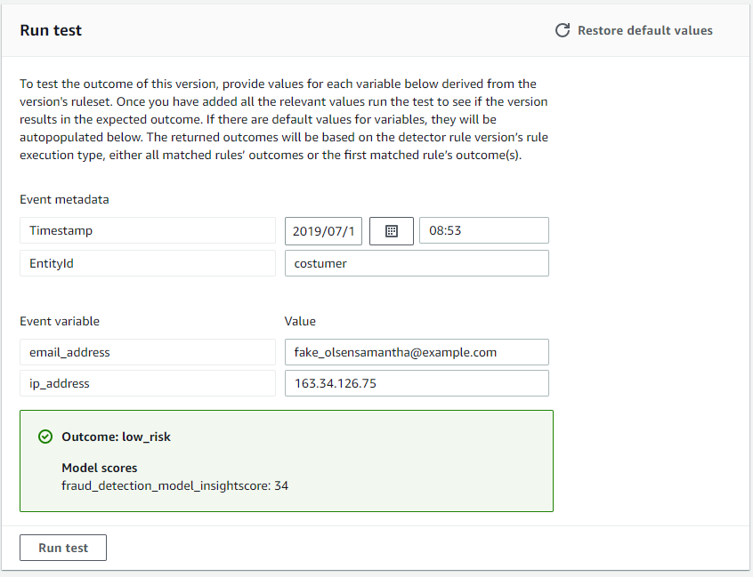
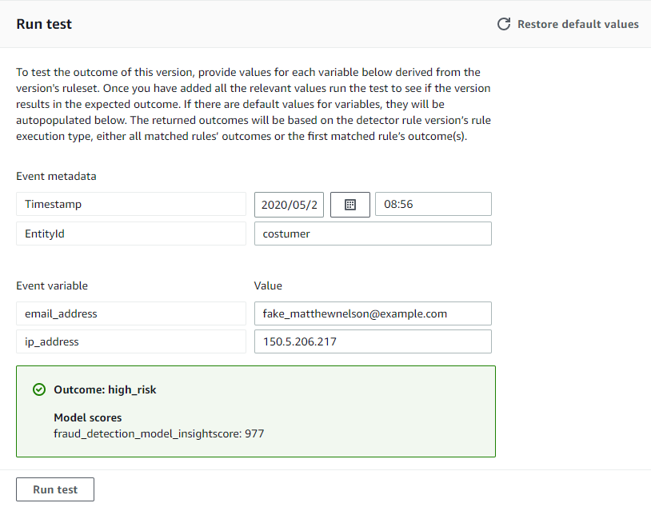

# Original post: images and notes

Source: [How I Created a fraud detection system on AWS](https://rhoguns.hashnode.dev/how-i-created-a-fraud-detection-system-on-aws), March 15, 2023. These notes summarize the published article and describe its screenshots. They are historical evidence, not results from this reconstructed repository. The [image source manifest](images/sources.json) records each original URL.

## 1. Detector flow

The diagram shows a model producing a score; user-defined thresholds and rules evaluate that score; the detector returns an outcome. In the article, the model was Online Fraud Insights, the event type was `registration`, and the entity was `customer`. The training data was uploaded to S3, but its file and field schema were not published.

## 2. Training review

The AWS console screenshot shows a score distribution and confusion matrix used to select a threshold. The displayed example uses a **500** score threshold, with true-positive rate **88.3%** and false-positive rate **13.7%** on a sample of 100,000 events. This 500 threshold is an evaluation view; the article later documents a separate high-risk rule at **900**. The trained model version and raw training data are not available.

## 3. Low-risk console test

The console test shows a registration event with an email and IP variable. It returned `low_risk` with model insight score **34**. The screenshot illustrates the test outcome, but it does not publish a reusable test-event fixture or the rule responsible for the low-risk classification.

## 4. High-risk console test

The second test returned `high_risk` with insight score **977**, consistent with the documented rule `$<fraud_detection_model>_insightscore >= 900`. The post also says `medium_risk` was created, but its rule threshold and a medium-risk test are not shown.
